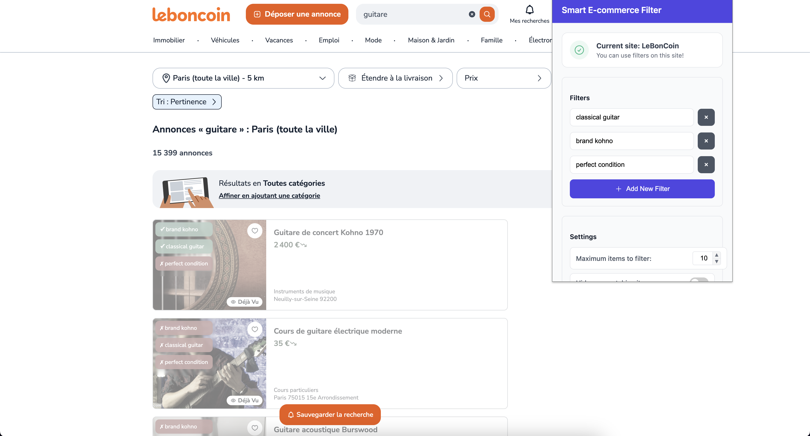
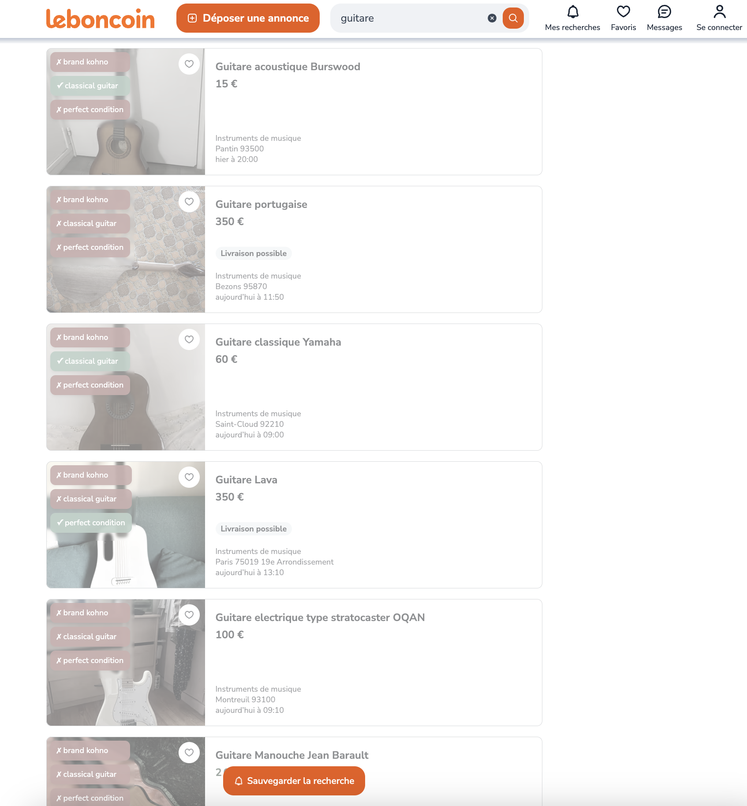

# FilterGenie

A browser extension that uses AI to filter search results based on natural language criteria.

## 📋 Overview

This project lets users apply natural language filters to search results. Instead of relying on rigid category filters, users can express what they're looking for in plain language:

- "Has no visible damage or scratches"
- "Includes original packaging"
- "Made of solid wood, not laminate"
- "Is a left-handed model"

The extension analyzes product images and descriptions using vision-language models (VLMs) to determine which items match your criteria, then highlights or filters them on the page.

<details>
<summary><b>Screenshots</b> (click to expand)</summary>



</details>

## 🏗️ Architecture

The project consists of two main components:

| Component | Description |
|-----------|-------------|
| **Chrome Extension** | Browser extension that injects into supported websites, captures product information, and displays filtering UI |
| **Backend API** | Python [FastAPI](https://fastapi.tiangolo.com/) service that handles product analysis using vision-language models |

<!-- ### Directory Structure

```mermaid
graph TD
-> TBD
``` -->

## 🔄 How It Works

1. User visits a supported website and runs a search
2. Browser extension detects the site and shows filtering UI
3. User enters natural language filters and clicks "Apply"
4. Extension sends product URLs to backend API
5. Backend scrapes product details and runs VLM analysis
6. Results are returned to browser extension
7. Matching products are highlighted, non-matching ones are dimmed or hidden

## 🧠 AI Implementation

The system can use either:

<details>
<summary><b>Local VLM models</b> (click to expand)</summary>

Uses the [Outlines](https://github.com/dottxt-ai/outlines) library with SmolVLM for local inference. This approach leverages Hugging Face Transformers to run the vision-language model directly on your machine, providing privacy and reducing API costs. The system automatically handles loading the model, processing images, and generating structured output.
</details>

<details>
<summary><b>Gemini API</b> (click to expand)</summary>

Uses Google's [Gemini API](https://ai.google.dev/) for vision-language analysis. This cloud-based approach provides access to state-of-the-art models without local compute requirements. The system handles authentication, API communication, and translates responses into structured data.
</details>

The system uses Pydantic to generate dynamic schemas based on user filters. The schema is then used by the VLM to guide the structured output and guarantee proper formatting. This allows for flexible and extensible filtering criteria.

## 🌐 Supported Websites

| Website | Status | Features |
|---------|--------|----------|
| leboncoin.fr | ✅ Fully supported | Product/search detection, image analysis |
| vinted.fr | ❌ Not supported | Product scraping only |
| ebay.fr | ❌ Not supported | Product scraping only |

## ⚡ Performance Optimizations

### Asynchronous Processing

The system uses asyncio for concurrent processing, enabling parallel product scraping, concurrent VLM analysis, and non-blocking API responses.

### Caching Mechanism

A smart caching system reduces redundant work by caching product scraping results, analysis outputs, and API responses.

## 🚀 Installation

### Backend Setup

1. Install UV (recommended)

   ```bash
   curl -LsSf https://astral.sh/uv/install.sh | sh
   ```

2. Install the project

   ```bash
   # with uv
   uv sync  # `uv sync --extra local` for local VLM dependencies
   ```

   or

   ```bash
   # with pip
   python -m venv .venv
   pip install -e .  # `pip install -e ".[local]"` for local VLM dependencies
   ```

3. Activate the virtual environment

   ```bash
   source .venv/bin/activate
   ```

4. Run the API server

   ```bash
   fastapi run backend/app.py  # with `USE_LOCAL=true` for local VLM inference
   ```

### Using Docker

1. Build the Docker image:

   ```bash
   # Build without local VLM support (OpenAI API)
   docker build -t filtergenie .
   ```

   or

   ```bash
   # Build with local VLM support (offline)
   docker build --build-arg USE_LOCAL=true -t filtergenie:local .
   ```

2. Run the Docker container:

   ```bash
   # When using API-based version
   docker run -p 8000:8000 \
     -e GEMINI_API_KEY=your_api_key_here \
     -e USE_LOCAL=false \
     filtergenie
   ```

   or

   ```bash
   # When using local VLM version
   docker run -p 8000:8000 \
     -e USE_LOCAL=true \
     filtergenie:local
   ```

   The API will be available at `http://localhost:8000`. Configure your Chrome extension to use this endpoint.

#### Environment Variables

- `GEMINI_API_KEY`: Your Gemini API key (required for API-based analysis)
- `USE_LOCAL`: Set to "true" to use local VLM models instead of Gemini API
- `API_KEY`: Optional API key for securing your FilterGenie API (only needed if you want to deploy and protect your API)

#### Testing Your Docker Deployment

Check if the API is running correctly:

```bash
curl http://localhost:8000/health
```

Should return:

```json
{"status":"ok"}
```

## 🧪 Running Tests

The project uses pytest for testing. To run the tests:

1. Install the development dependencies:

   ```bash
   uv sync --extra dev
   ```

2. Run tests:

   ```bash
   pytest
   ```

## 📝 Usage

1. Go to a supported website (leboncoin.fr, vinted.fr, or ebay.fr)
2. Search for products you're interested in
3. Click the extension icon in your browser toolbar
4. Enter natural language filter criteria:
   - "Has original packaging"
   - "No visible scratches or damage"
   - "Includes all accessories"
5. Set maximum items to scan (higher = more thorough but slower)
6. Click "Apply Filters"
7. Matching products will be highlighted, non-matching ones dimmed or hidden
