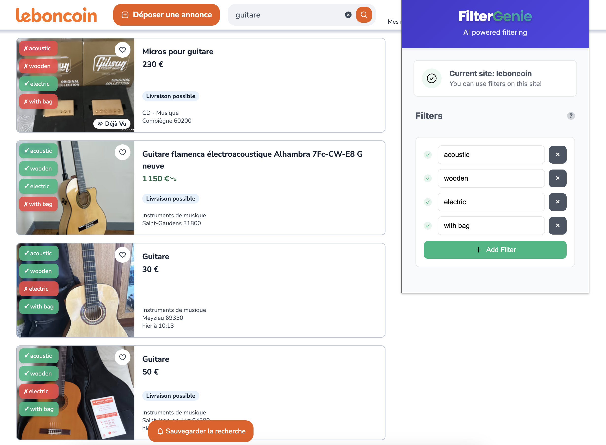

# FilterGenie 🧞‍♂️

> AI-powered browser extension that filters search results using natural language criteria.

<p align="center">
  
</p>

## ✨ Features

- Filter search results using natural language (e.g., "no scratches", "original packaging")
- Vision-language model analysis of item images and descriptions
- Supports multiple e-commerce platforms
- Available as both cloud API and local offline version

## 🚀 Quick Start

### Extension Setup

1. Download the extension from [Chrome Web Store](https://chromewebstore.google.com/detail/filtergenie/...) (coming soon)
2. Click the extension icon on a supported website
3. Enter your natural language filters and apply

### Run Your Own API Server

#### Using Docker

```bash
# Quick start with API mode
docker build -t filtergenie .
docker run -p 8000:8000 -e MODEL_REMOTE_API_KEY=your_api_key_here filtergenie

# Or with local VLM (offline mode)
docker build --build-arg MODEL_USE_LOCAL=true -t filtergenie:local .
docker run -p 8000:8000 -e MODEL_USE_LOCAL=true filtergenie:local
```

#### Local Development

```bash
# Install dependencies
curl -LsSf https://astral.sh/uv/install.sh | sh
uv sync  # Add `--extra local` for offline VLM support

# Run the API
fastapi dev backend/app.py
```

#### Hosted API

The API is also available at `https://filtergenie-api.onrender.com/` (requires API key).
FastAPI docs are available at `https://filtergenie-api.onrender.com/docs`.

## 📋 How It Works

1. User enters natural language filter criteria
2. Extension captures item data from the webpage
3. Backend analyzes items using vision-language models
4. Results highlight matching items and dim/hide non-matching ones

## 🧠 Technical Details

- **Backend**: Python FastAPI service for item analysis
- **AI Models**:
  - Cloud: Google Gemini API for vision-language analysis
  - Local: Outlines library with SmolVLM for offline inference
- **Extension**: Browser extension for UI and webpage integration
- **Supported Sites**: leboncoin.fr (full), vinted.fr (partial), ebay.fr (partial)

## 💻 Development

```bash
# Run tests
uv sync --dev
pytest

# Health check
curl http://localhost:8000/health
# Or for hosted API
curl https://filtergenie-api.onrender.com/health  # /health is public
```

## Environment Variables

The application can be configured with the following environment variables:

- `API_KEY`: Authentication key for securing the API
- `MODEL_USE_LOCAL`: Set to `true` to use local model inference instead of remote API
- `MODEL_REMOTE_API_KEY`: API key for Google Gemini API
- `MODEL_REMOTE_NAME`: Model name for remote API (default: gemini-2.0-flash-lite)
- `MODEL_LOCAL_NAME`: Local model name or path
- `MODEL_LOCAL_DEVICE`: Device for local model execution (default: auto)
- `CACHE_DB_PATH`: Path to the SQLite cache database
