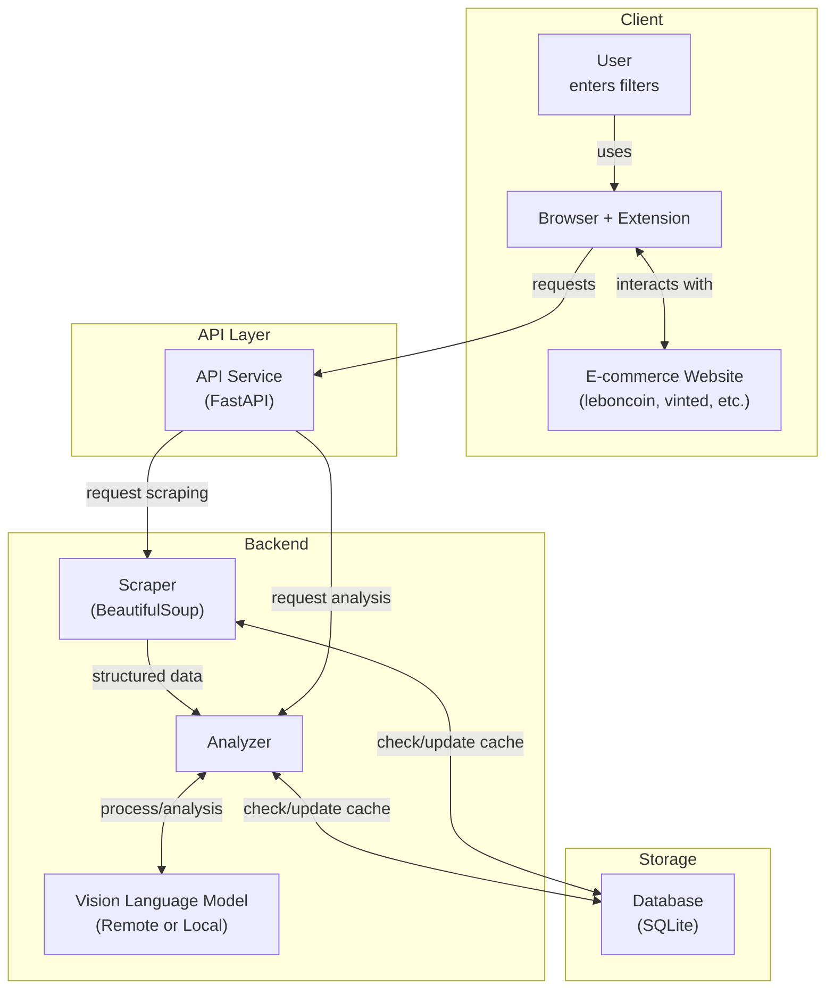

# FilterGenie 🧞‍♂️

<!-- Project info badges -->
<div align="center">

[](https://github.com/daltunay/filtergenie/blob/master/LICENSE)
[](https://github.com/daltunay/filtergenie/actions/workflows/ci.yml)
[](https://github.com/daltunay/filtergenie/commits/master/?author=daltunay)
[](https://filtergenie-api.onrender.com/)

</div>

<!-- Tech stack badges -->
<div align="center">

[](https://fastapi.tiangolo.com/)
[](https://github.com/astral-sh/uv)
[](https://docs.pydantic.dev/latest/contributing/#badges)
[](https://console.groq.com/docs/model/llama-4-scout-17b-16e-instruct)
[](https://redis.io/)

</div>

<!-- Social badge -->
<div align="center">

[](https://www.linkedin.com/in/daltunay/)
[](https://github.com/daltunay)

</div>

<hr>

<p align="center">
  
</p>
FilterGenie is an AI-powered browser extension and API that filters e-commerce search results using natural language and vision-language models.

## Features

- Filter listings with natural language (e.g., "no scratches", "original packaging")
- Analyzes item images and descriptions
- Works with multiple e-commerce sites
- Use as browser extension or API (cloud/local)

## Supported Websites

| Name       | Domains                                           | Status  |
| ---------- | ------------------------------------------------- | ------- |
| leboncoin  | leboncoin.fr                                      | ✅ DONE |
| vinted     | vinted.fr, vinted.com, vinted.it, vinted.de, ...  | ✅ DONE |
| ebay       | ebay.fr, ebay.com, ebay.it, ebay.de, ...          | 🛠️ WIP  |
| amazon     | amazon.fr, amazon.com, amazon.it, amazon.de, ...  | 🛠️ WIP  |
| aliexpress | aliexpress.fr, aliexpress.com, aliexpress.it, ... | 📝 TODO |
| doctolib   | doctolib.fr                                       | 📝 TODO |
| seloger    | seloger.fr                                        | 📝 TODO |

<details>
<summary>Architecture</summary>



</details>

## Quick Start

### Browser Extension

Use with a **local API** (`http://localhost:8000`) or the **hosted API** (`https://filtergenie-api.onrender.com`).

To install:

1. Download the latest `extension.zip` from the [releases page](https://github.com/daltunay/filtergenie/releases).
2. Unzip the file to extract the `extension` folder.
3. In your browser, open the extensions page (e.g. `chrome://extensions` for Chrome)
4. Enable "Developer mode" (top right corner)
5. Click "Load unpacked" and select the extracted `extension` folder
6. Choose API mode (Local/Remote) and enter your API key if needed.

### Local API

#### Requirements

- [uv](https://docs.astral.sh/uv/) (Python package manager):
  `curl -LsSf https://astral.sh/uv/install.sh | sh`

#### Setup

```bash
# Create the virtual environment
uv venv .venv

# Activate the virtual environment
source .venv/bin/activate

# Install the dependencies
uv sync
```

#### Run the API

```bash
# Run the FastAPI server
GROQ_API_KEY="your_groq_api_key" fastapi run backend/app.py
```

Or with Docker:

```bash
# Build the Docker image
docker build -t filtergenie .

# Run the Docker container
docker run --rm \
  -e GROQ_API_KEY="your_groq_api_key" \
  -p 8000:8000 \
  filtergenie
```

> Note: To use caching, you must have a running Redis server on `localhost:6379` and pass `CACHE_ENABLED=true` as an environment variable to the API.

## Privacy Policy

FilterGenie is designed with user privacy in mind. We are committed to protecting your data and being transparent about how information is handled.

### What data does FilterGenie collect?

- **Website Content Only:**
  FilterGenie processes the content of web pages you visit on supported e-commerce sites (such as product titles, descriptions, and images) to provide its filtering functionality.
  **No other data is collected.**

### What data does FilterGenie NOT collect?

- We do **not** collect, store, or transmit any of the following:
  - Personally identifiable information (PII) such as your name, address, email, age, or identification numbers
  - Health information
  - Financial or payment information
  - Authentication information (passwords, credentials, secret questions, or codes)
  - Personal communications (emails, SMS, chat messages)
  - Location data (IP address, GPS, or nearby points of interest)
  - Web browsing history (list of pages visited, titles, or timestamps)
  - User activity (network monitoring, clicks, mouse position, scroll or keystroke logging)

### How is your data used?

- The extension only analyzes the visible content of e-commerce listings to provide filtering results.
- No user data is sold or transferred to third parties.
- No user data is used for purposes unrelated to the core filtering functionality.
- No user data is used for creditworthiness or lending purposes.

### Data storage and transfer

- All processing is performed locally in your browser or sent to the FilterGenie API (cloud or local, as configured by you) for analysis.
- No personal or sensitive data is ever collected, stored, or transferred by FilterGenie.

### Certification

- We do **not** sell or transfer user data to third parties except as required for the core functionality.
- We do **not** use or transfer user data for unrelated purposes.
- We do **not** use or transfer user data for creditworthiness or lending.

For any questions about privacy, please contact the developer at [daniel.altunay@gmail.com](mailto:daniel.altunay@gmail.com).
