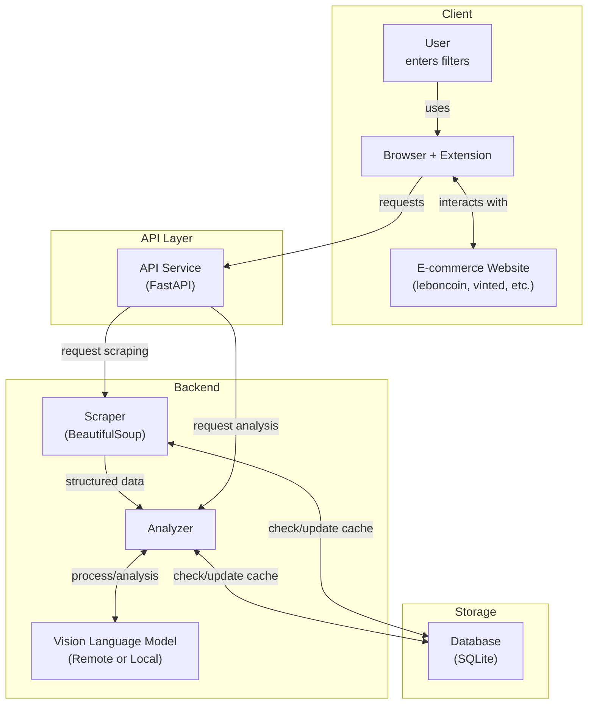

# FilterGenie 🧞‍♂️

<!-- Project info badges -->
<div align="center">

[](https://github.com/daltunay/filtergenie/blob/master/LICENSE)
[](https://github.com/daltunay/filtergenie/actions/workflows/ci.yml)
[](https://github.com/daltunay/filtergenie/commits/master/?author=daltunay)
[](https://github.com/daltunay/filtergenie/deployments)
[](https://filtergenie-api.onrender.com/)

</div>

<!-- Tech stack badges -->
<div align="center">

[](https://fastapi.tiangolo.com/)
[](https://github.com/astral-sh/uv)
[](https://docs.pydantic.dev/latest/contributing/#badges)
[](https://www.sqlalchemy.org/)
[](https://www.crummy.com/software/BeautifulSoup/)
[](https://openai.com/)
[](https://ai.google.dev/)

</div>

<!-- Social badge -->
<div align="center">

[](https://www.linkedin.com/in/daltunay/)
[](https://github.com/daltunay)

</div>

<hr>

<p align="center">
  
</p>
FilterGenie is an AI-powered browser extension and API that filters e-commerce search results using natural language and vision-language models.

## Features

- Filter listings with natural language (e.g., "no scratches", "original packaging")
- Analyzes item images and descriptions
- Works with multiple e-commerce sites
- Use as browser extension or API (cloud/local)

## Supported Websites

| Name       | Domains                                           | Status  |
| ---------- | ------------------------------------------------- | ------- |
| leboncoin  | leboncoin.fr                                      | ✅ DONE |
| vinted     | vinted.fr, vinted.com, vinted.it, vinted.de, ...  | ✅ DONE |
| ebay       | ebay.fr, ebay.com, ebay.it, ebay.de, ...          | 🛠️ WIP  |
| amazon     | amazon.fr, amazon.com, amazon.it, amazon.de, ...  | 🛠️ WIP  |
| aliexpress | aliexpress.fr, aliexpress.com, aliexpress.it, ... | 📝 TODO |
| doctolib   | doctolib.fr                                       | 📝 TODO |
| seloger    | seloger.fr                                        | 📝 TODO |

<details>
<summary>Architecture</summary>



</details>

## Quick Start

### Browser Extension

You can use the FilterGenie extension with **either**:

- A **locally deployed API** (running on your own machine, e.g. `http://localhost:8000`)
- The **hosted API** at [`https://filtergenie-api.onrender.com`](https://filtergenie-api.onrender.com)

**To configure the extension:**

1. Clone the repo:

   ```bash
   git clone https://github.com/daltunay/filtergenie.git
   ```

2. In your browser, open the extensions page (e.g. `chrome://extensions` for Chrome)
3. Enable "Developer mode" (top right corner toggle)
4. Click "Load unpacked" and select the `extension` folder
5. **Choose your API mode (Local or Remote) and enter your API key if needed.**
   - For local API: `http://localhost:8000`
   - For hosted API: `https://filtergenie-api.onrender.com`
   - If you need an API key for the hosted API, please ask me directly.

### Local API

#### Prerequisites

- Install [**uv**](https://docs.astral.sh/uv/) (Python package manager):

  ```bash
  curl -LsSf https://astral.sh/uv/install.sh | sh
  ```

1. Create and activate a virtual environment:

   ```bash
   uv venv .venv
   source .venv/bin/activate
   ```

2. Install dependencies:

   ```bash
   uv sync
   ```

   For offline/local VLM support, add `--extra local`.

3. Run the API server:

   ```bash
   # For remote VLM
   MODEL__REMOTE__API_KEY=your_gemini_api_key fastapi dev backend/app.py
   ```

   or

   ```bash
   # For local VLM
   MODEL__USE_LOCAL=true fastapi dev backend/app.py
   ```

Or use Docker:

```bash
# Build the image
docker build -t filtergenie .

# Run the container
docker run --rm \
  -p 8000:8000 \
  -v ./data:/app/data \
  -e MODEL__REMOTE__API_KEY=your_gemini_api_key \
  filtergenie
```

> **Note:** Mount the `data` folder to persist the SQLite database outside the container.

For local VLM:

```bash
# Build the image
docker build --build-arg LOCAL=true -t filtergenie:local .

# Run the container
docker run --rm \
  -p 8000:8000 \
  -v ./data:/app/data \
  -v ~/.cache/huggingface:/root/.cache/huggingface \
  filtergenie:local
```

> **Note:** Mount the `~/.cache/huggingface` folder to persist the Hugging Face model cache outside the container.

## Configuration

**Tip:** You can also create a `.env` file in the project root to set these environment variables. The application will automatically load variables from `.env` if present.

| Variable                  | Description                                      | Default / Example                                          |
| ------------------------- | ------------------------------------------------ | ---------------------------------------------------------- |
| `API__KEY`                | API authentication key                           | `None` (no auth)                                           |
| `MODEL__USE_LOCAL`        | Use local model (`true`/`false`)                 | `false`                                                    |
| `MODEL__REMOTE__API_KEY`  | Remote model API key (required for remote usage) | (your remote model API key)                                |
| `MODEL__REMOTE__BASE_URL` | Remote model API base URL                        | `https://generativelanguage.googleapis.com/v1beta/openai/` |
| `MODEL__REMOTE__NAME`     | Remote model name                                | `gemini-2.0-flash-lite`                                    |
| `MODEL__LOCAL__NAME`      | Local model name/path                            | `HuggingFaceTB/SmolVLM-Instruct`                           |
| `MODEL__LOCAL__DTYPE`     | Local model data type                            | `bfloat16`                                                 |
| `MODEL__LOCAL__DEVICE`    | Device for local inference                       | `auto`                                                     |

> **Note:** You can use any OpenAI-compatible API for the remote model by setting `MODEL__REMOTE__BASE_URL` and `MODEL__REMOTE__NAME` accordingly. By default, the configuration uses Gemini via the Google API.
