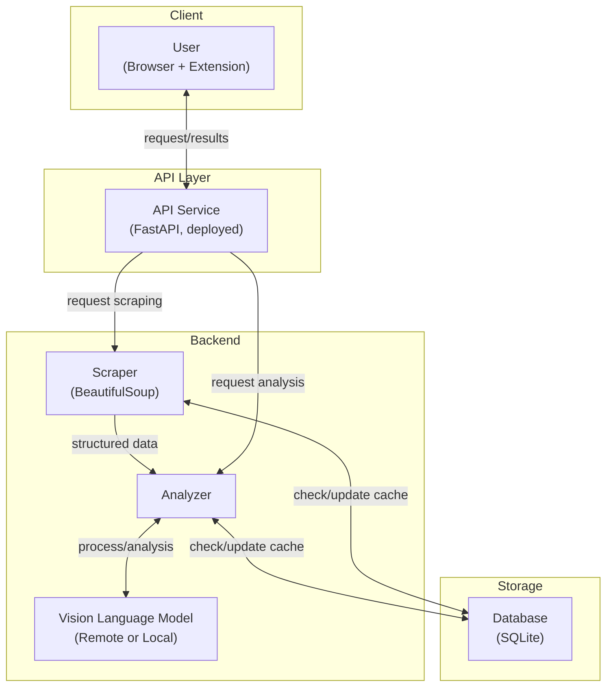

# FilterGenie 🧞‍♂️

FilterGenie is an AI-powered browser extension and API that filters e-commerce search results using natural language and vision-language models.

## Architecture



## Features

- Filter listings with natural language (e.g., "no scratches", "original packaging")
- Analyzes item images and descriptions
- Works with multiple e-commerce sites
- Use as browser extension or API (cloud/local)

## Quick Start

### Browser Extension

1. Clone the repo:

   ```bash
   git clone https://github.com/daltunay/filtergenie.git
   ```

2. In your browser, open the extensions page (e.g. `chrome://extensions/`)
3. Enable "Developer mode"
4. Click "Load unpacked" and select the `extension` folder

### API

1. Create and activate a virtual environment:

   ```bash
   uv venv .venv
   source .venv/bin/activate
   ```

2. Install dependencies:

   ```bash
   uv sync
   ```

   For offline/local VLM support, add `--extra local`.

3. Run the API server:

   ```bash
   fastapi dev backend/app.py
   ```

Or use Docker:

```bash
docker build -t filtergenie .
docker run \
  -p 8000:8000 \
  -v $.data:/app/data \
  -e MODEL__REMOTE__API_KEY=your_gemini_api_key \
  filtergenie
```

> **Note:** Mount the `data` folder (`-v $./data:/app/data`) to persist the SQLite database outside the container.

For local VLM:

```bash
docker build --build-arg LOCAL=true -t filtergenie:local .
docker run \
  -p 8000:8000 \
  -v $.data:/app/data \
  -e MODEL__USE_LOCAL=true \
  filtergenie:local
```

## API Usage

- Hosted: `https://filtergenie-api.onrender.com/` (API key required)
- Docs: `https://filtergenie-api.onrender.com/docs`
- Health check: `curl https://filtergenie-api.onrender.com/health`

## Configuration

Set these environment variables as needed:

- `API_KEY`: API authentication key (default: `None`, no auth)
- `MODEL__USE_LOCAL`: Use local model (`true`/`false`, default: `false`)
- `MODEL__REMOTE__API_KEY`: Remote model API key (required for remote usage)
- `MODEL__REMOTE__NAME`: Remote model name (default: `gemini-2.0-flash-lite`)
- `MODEL__LOCAL__NAME`: Local model name/path (default: `HuggingFaceTB/SmolVLM-Instruct`)
- `MODEL__LOCAL__DTYPE`: Local model data type (default: `bfloat16`)
- `MODEL__LOCAL__DEVICE`: Device for local inference (default: `auto`)
