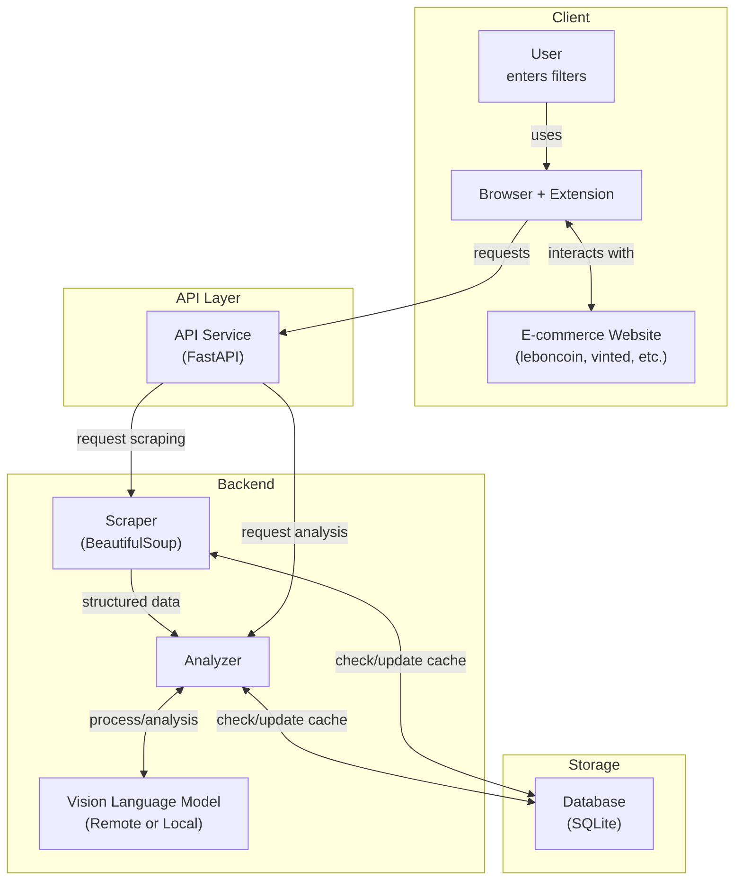

# FilterGenie 🧞‍♂️

<!-- Project info badges -->
<div align="center">

[](https://github.com/daltunay/filtergenie/blob/master/LICENSE)
[](https://github.com/daltunay/filtergenie/actions/workflows/ci.yml)
[](https://github.com/daltunay/filtergenie/commits/master/?author=daltunay)
[](https://github.com/daltunay/filtergenie/deployments)
[](https://filtergenie-api.onrender.com/)

</div>

<!-- Tech stack badges -->
<div align="center">

[](https://fastapi.tiangolo.com/)
[](https://github.com/astral-sh/uv)
[](https://docs.pydantic.dev/latest/contributing/#badges)
[](https://www.sqlalchemy.org/)
[](https://www.crummy.com/software/BeautifulSoup/)
[](https://console.groq.com/docs/model/llama-4-scout-17b-16e-instruct)

</div>

<!-- Social badge -->
<div align="center">

[](https://www.linkedin.com/in/daltunay/)
[](https://github.com/daltunay)

</div>

<hr>

<p align="center">
  
</p>
FilterGenie is an AI-powered browser extension and API that filters e-commerce search results using natural language and vision-language models.

## Features

- Filter listings with natural language (e.g., "no scratches", "original packaging")
- Analyzes item images and descriptions
- Works with multiple e-commerce sites
- Use as browser extension or API (cloud/local)

## Supported Websites

| Name       | Domains                                           | Status  |
| ---------- | ------------------------------------------------- | ------- |
| leboncoin  | leboncoin.fr                                      | ✅ DONE |
| vinted     | vinted.fr, vinted.com, vinted.it, vinted.de, ...  | ✅ DONE |
| ebay       | ebay.fr, ebay.com, ebay.it, ebay.de, ...          | 🛠️ WIP  |
| amazon     | amazon.fr, amazon.com, amazon.it, amazon.de, ...  | 🛠️ WIP  |
| aliexpress | aliexpress.fr, aliexpress.com, aliexpress.it, ... | 📝 TODO |
| doctolib   | doctolib.fr                                       | 📝 TODO |
| seloger    | seloger.fr                                        | 📝 TODO |

<details>
<summary>Architecture</summary>



</details>

## Quick Start

### Browser Extension

Use with a **local API** (`http://localhost:8000`) or the **hosted API** (`https://filtergenie-api.onrender.com`).

To install:

1. Download the latest `extension.zip` from the [releases page](https://github.com/daltunay/filtergenie/releases).
2. Unzip the file to extract the `extension` folder.
3. In your browser, open the extensions page (e.g. `chrome://extensions` for Chrome)
4. Enable "Developer mode" (top right corner)
5. Click "Load unpacked" and select the extracted `extension` folder
6. Choose API mode (Local/Remote) and enter your API key if needed.

### Local API

#### Requirements

- [uv](https://docs.astral.sh/uv/) (Python package manager):
  `curl -LsSf https://astral.sh/uv/install.sh | sh`

#### Setup

```bash
uv venv .venv
source .venv/bin/activate
uv sync
```

#### Configuration

Set your Groq API key as an environment variable before running the API:

```bash
export GROQ_API_KEY="your_groq_api_key"
```

You can get a Groq API key at: [console.groq.com](https://console.groq.com/keys)

Optionally, set the model:

```bash
export GROQ_MODEL_NAME="meta-llama/llama-4-scout-17b-16e-instruct"  # default
```

You can also use a `.env` file in the project root:

```env
GROQ_API_KEY="your_groq_api_key"
GROQ_MODEL_NAME="meta-llama/llama-4-scout-17b-16e-instruct"
```

#### Run the API

```bash
fastapi run backend/app.py
```

Or with Docker:

```bash
docker build -t filtergenie .
docker run --rm \
  -e GROQ_API_KEY="your_groq_api_key" \
  -e GROQ_MODEL_NAME="meta-llama/llama-4-scout-17b-16e-instruct" \
  -p 8000:8000 \
  -v ./data:/app/data \
  filtergenie
```

> **Note:** Mount the `data` folder to persist the SQLite database outside the container.
