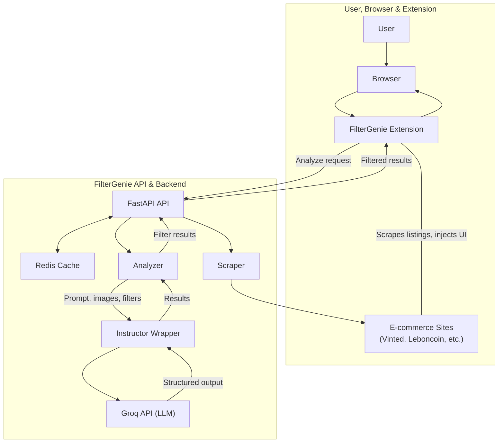

# FilterGenie 🧞‍♂️

<!-- Project info -->
<div align="center">

[](https://github.com/daltunay/filtergenie/blob/master/LICENSE)
[](https://github.com/daltunay/filtergenie/actions/workflows/ci.yml)
[](https://github.com/daltunay/filtergenie/commits/master/?author=daltunay)
[](https://filtergenie-api.onrender.com/)

</div>

<!-- Tech stack -->
<div align="center">

[](https://fastapi.tiangolo.com/)
[](https://github.com/astral-sh/uv)
[](https://docs.pydantic.dev/latest/contributing/#badges)
[](https://console.groq.com/docs/model/llama-4-scout-17b-16e-instruct)
[](https://redis.io/)

</div>

<!-- Social -->
<div align="center">

[](https://www.linkedin.com/in/daltunay/)
[](https://github.com/daltunay)

</div>

<hr>

<p align="center">
  
</p>
FilterGenie is an AI-powered browser extension and API that filters e-commerce search results using natural language and vision-language models.

## Features

- Filter listings with natural language (e.g., "no scratches", "original packaging")
- Analyzes item images and descriptions
- Works with multiple e-commerce sites
- Use as browser extension or API (cloud/local)

## Supported Websites

| Name       | Domains                                           | Status  |
| ---------- | ------------------------------------------------- | ------- |
| leboncoin  | leboncoin.fr                                      | ✅ DONE |
| vinted     | vinted.fr, vinted.com, vinted.it, vinted.de, ...  | ✅ DONE |
| ebay       | ebay.fr, ebay.com, ebay.it, ebay.de, ...          | 🛠️ WIP  |
| amazon     | amazon.fr, amazon.com, amazon.it, amazon.de, ...  | 🛠️ WIP  |
| aliexpress | aliexpress.fr, aliexpress.com, aliexpress.it, ... | 📝 TODO |
| doctolib   | doctolib.fr                                       | 📝 TODO |
| seloger    | seloger.fr                                        | 📝 TODO |

## Architecture

The architecture of FilterGenie is designed to efficiently filter e-commerce listings using both client-side and backend components. Below is a high-level overview of how the system works:

- **Client Side**: The browser extension scrapes listings from supported e-commerce sites and injects the FilterGenie UI for user interaction.
- **Backend/API**: The FastAPI backend handles requests from the extension, manages caching with Redis, scrapes additional data if needed, and analyzes listings using AI models.
- **AI & Analysis**: The Analyzer and Instructor components process listing data, interact with the Groq API (LLM), and return structured, filtered results to the user.



**Key Components:**

- **Extension**: Scrapes listings and provides the user interface.
- **FastAPI API**: Main backend entry point for requests and responses.
- **Redis**: Caches results for faster response times.
- **Scraper**: Gathers additional data from e-commerce sites if needed.
- **Analyzer**: Processes and filters listings using AI.
- **Instructor & Groq**: Handles advanced AI analysis and structured output.

This modular architecture allows FilterGenie to be flexible, scalable, and easy to maintain, supporting both local and cloud deployments.

## Quick Start

### Browser Extension

Use with a **local API** (`http://localhost:8000`) or the **hosted API** (`https://filtergenie-api.onrender.com`).

To install:

1. Download the latest `extension.zip` from the [releases page](https://github.com/daltunay/filtergenie/releases).
2. Unzip the file to extract the `extension` folder.
3. In your browser, open the extensions page (e.g. `chrome://extensions` for Chrome)
4. Enable "Developer mode" (top right corner)
5. Click "Load unpacked" and select the extracted `extension` folder
6. Choose API mode (Local/Remote) and enter your API key if needed.

### Local API

#### Requirements

- [uv](https://docs.astral.sh/uv/) (Python package manager):
  `curl -LsSf https://astral.sh/uv/install.sh | sh`

#### Setup

```bash
# Create the virtual environment
uv venv .venv

# Activate the virtual environment
source .venv/bin/activate

# Install the dependencies
uv sync
```

#### Run the API

```bash
# Run the FastAPI server
GROQ_API_KEY="your_groq_api_key" fastapi run backend/app.py
```

Or with Docker:

```bash
# Build the Docker image
docker build -t filtergenie .

# Run the Docker container
docker run --rm \
  -e GROQ_API_KEY="your_groq_api_key" \
  -p 8000:8000 \
  filtergenie
```

> Note: To use caching, you must have a running Redis server on `localhost:6379` and pass `CACHE_ENABLED=true` as an environment variable to the API.
